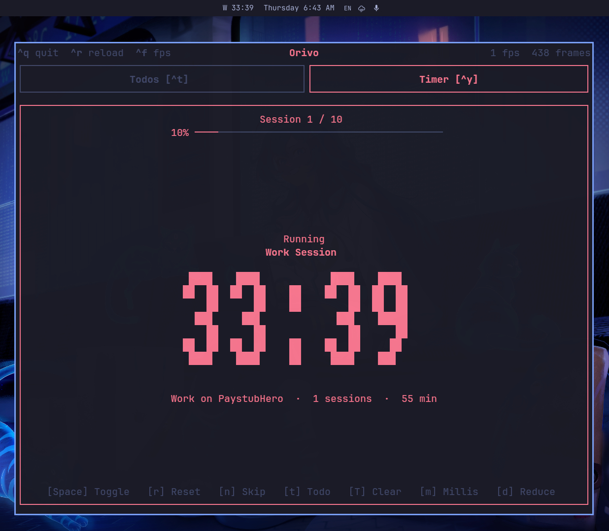

# omarchy-orivo-plugin



An [Omarchy](https://omarchy.org) bar widget that shows the current
[orivo](https://github.com/mt-shihab26/orivo) pomodoro session and
countdown, e.g. `W 24:59` (`W` Work, `B` Break, `L` Long Break — hover for
the full phase name).

It talks to orivo over orivo's live IPC socket:

- `~/.local/state/orivo/orivo.sock` — a Unix domain socket orivo opens
  while its TUI is running. `scripts/orivo-status.sh` connects with
  `nc -U`, and orivo writes back one JSON line describing its current
  in-memory state (phase, exact remaining time, and whether it's actually
  running or paused) before closing the connection.
- `~/.local/state/orivo/store.json` and `~/.config/orivo/config.toml` are
  used only as a fallback, to show the last-saved (frozen, non-ticking)
  phase and time when orivo isn't currently open.

This requires an orivo build that includes the IPC worker
(`src/workers/ipc.rs`, spawned from `TimerTab::new`) — orivo itself never
shells out to anything; it just opens a socket and writes to it.

## Development

```sh
./link.sh          # symlink this repo into ~/.config/omarchy/plugins/omarchy-orivo-plugin
./link.sh --remove # remove the symlink
```

After linking, load it:

```sh
omarchy-shell shell rescanPlugins
omarchy plugin enable omarchy-orivo-plugin --section center --index 0
```

Saved edits under this directory hot-reload automatically; if a change
doesn't apply, force a rescan with `omarchy-shell shell rescanPlugins`, or
restart the shell entirely with `omarchy restart shell`.
